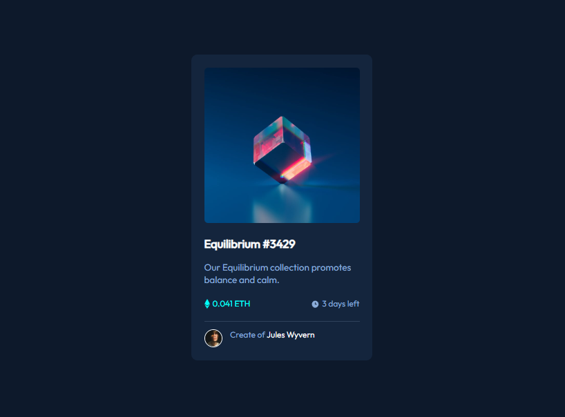

# NFT Card - Solução do desafio do Frontend Mentor 


Esta é uma solução para o [desafio do componente de cartão de visualização NFT no Frontend Mentor](https://www.frontendmentor.io/challenges/nft-preview-card-component-SbdUL_w0U). Os desafios do Frontend Mentor ajudam você a melhorar suas habilidades de codificação através da construção de projetos realistas. 

## Índice

- [Overview](#overview)
  - [O desafio](#o-desafio)
  - [Print do projeto](#print-do-projeto)
  - [Link](#link)
- [Meu processo](#meu-processo)
  - [Construído com](#construido-com)
  - [O que aprendi](#o-que-aprendi)
  - [Desenvolvimento contínuo](#desenvolviment-continuo)
- [Autora](#autora)
- [Agradecimentos](#agradecimentos)

## Overview

### O desafio

O desafio constiste em:

- testar nossos conhecimentos com front-end, mas expecificadamente o CSS, desafiando a desenvolver estilos em blocos;
- mostrar nossa capacidade em utilizar o display e position;

### Print do projeto

 

### Link

- Código do desenvolvimento: [NFT Card](https://github.com/maiarasteffen/nft-card-front)
- Front do projeto: [Front](https://keen-buttercream-7e2574.netlify.app/)

## Meu processo

### Construído com

- Semântica HTML;
- Propriedades CSS;
- Flexbox;
- Positions;
- Before e After;
- Variáveis no CSS;

### O que aprendi

Aprendi como distribuir as classes conforme os elementos dentro do HTML, sabendo como estilizar cada componente de acordo com a classe distribuida. Também aprendi muito como alinhar os elementos filhos dentro do elemento pai e colocar sua posição sem que quebre o layout.

Código utilizado:

```html
<head>
  <meta charset="UTF-8">
  <meta name="viewport" content="width=device-width, initial-scale=1.0">
  <meta name="description" content="NFT preview card component">
  <link rel="icon" type="image/png" sizes="32x32" href="./src/images/favicon-32x32.png">
  <link rel="stylesheet" href="./src/css/reset.css">
  <link rel="stylesheet" href="./src/css/variable.css">
  <link rel="stylesheet" href="./src/css/style.css">

  <link rel="preconnect" href="https://fonts.googleapis.com">
  <link rel="preconnect" href="https://fonts.gstatic.com" crossorigin>
  <link href="https://fonts.googleapis.com/css2?family=Outfit&display=swap" rel="stylesheet">

  <title>NFT preview card component</title>
</head>
<body>
  <main>
    <div class="nft-card">
      <a href="#" class="image-link">
          
      </a>
      <a href="#" class="title-link">
        <h2 class="title">Equilibrium #3429</h2>
      </a>
      <p class="about">Our Equilibrium collection promotes balance and calm.</p>
      <div class="info">
        <p class="price">0.041 ETH</p>
        <p class="days-left">3 days left</p>
      </div>
      <div class="creator">
        
        <p class="text">Create of <a class="name" href="#">Jules Wyvern</a></p>
      </div>
    </div>
  </main>
</body>
```
```css
body {
    background-color: var(--neutral-dark);
    font-family: 'Outfit', sans-serif;
}

main {
    display: flex;
    justify-content: center;
    align-items: center;
    height: 100vh;
    padding: 0 20px;
}

.nft-card {
    max-width: 350px;
    background-color: var(--neutral-medium);
    border-radius: 12px;
    padding: 25px;
}

.nft-card .image-link .image {
    max-width: 100%;
    border-radius: 7px;
}

.nft-card .image-link {
    height: 100%;
    display: flex;
    position: relative;
}

.nft-card .image-link::before {
    content: '';
    background-color: var(--primary-medium);
    width: 100%;
    height: 100%;
    position: absolute;
    transition: 0.3s ease-in-out;
    opacity: 0;
}

.nft-card .image-link::after {
    content: '';
    background-image: url(../images/icon-view.svg);
    background-repeat: no-repeat;
    background-position: center;
    position: absolute;
    width: 100%;
    height: 100%;
    transition: 0.3s ease-in-out;
    opacity: 0;
}

.nft-card .image-link:hover::before {
    opacity: 0.5;
}

.nft-card .image-link:hover::after {
    opacity: 1;
}

.nft-card .title-link .title {
    font-size: 22px;
    color: #fff;
    margin: 25px 0 20px;
}

.nft-card .title-link .title:hover {
    color: var(--primary-medium);
}

.nft-card .about {
    color: var(--primary-soft);
    font-size: 18px;
    font-weight: 300;
    line-height: 25px;
    margin-bottom: 23px;
}

.nft-card .info {
    display: flex;
    justify-content: space-between;
    margin-bottom: 23px;
}

.nft-card .info .price {
    color: var(--primary-medium);
    display: flex;
}

.nft-card .info .price::before {
    content: '';
    background-image: url(../images/icon-ethereum.svg);
    background-repeat: no-repeat;
    background-position: center;
    width: 11px;
    display: inline-block;
    margin-right: 5px;
}

.nft-card .info .days-left {
    color: var(--primary-soft);
    display: flex;
}

.nft-card .info .days-left::before {
    content: '';
    background-image: url(../images/icon-clock.svg);
    background-repeat: no-repeat;
    background-position: center;
    width: 15px;
    display: inline-block;
    margin-right: 5px;
    
}

.nft-card .creator {
    display: flex;
    border-top: 1px solid var(--neutral-soft);
    padding-top: 15px ;
}

.nft-card .creator .avatar {
    max-width: 35px;
    border: 1px solid #fff;
    border-radius: 50%;
    margin-right: 15px;
    align-items: center;
}

.nft-card .creator .text {
    color: var(--primary-soft);    
}

.nft-card .creator .text .name {
    color: #fff;
}

.nft-card .creator .text .name:hover {
    color: var(--primary-medium);
}
```

### Desenvolvimento contínuo

Irei continuar me aperfeiçoando na parte de CSS, focando no Flexbox e Grid. Além de estilizar elementos com pseudo-elementos. Também daqui em diante irei me aperfeiçoar na área de React Native e Rest API com Node.js! Por isso estou treinando bem a base do Front-end!

## Author

- Linkedin - [Maiara Steffen](https://www.linkedin.com/in/maiara-steffen/)
- Frontend Mentor - [@maiarasteffen](https://www.frontendmentor.io/profile/maiarasteffen)
- Instagram - [@maiara_steffen](https://www.instagram.com/maiara_steffen/)
- GitHub - [@maiarasteffen](https://github.com/maiarasteffen/)

## Agradecimentos

Primeiro quero agradecer muito a Deus por sempre estar me dando oportunidades de me desenvolver cada vez mais na carreira de programadora, também quero agradecr muito ao [Dev Em Dobro](https://www.instagram.com/devemdobro/), os irmãos que me ensina e ensina muitas pessoas a se desnevolverem e crescerem no mercado de trabalho como programador!
